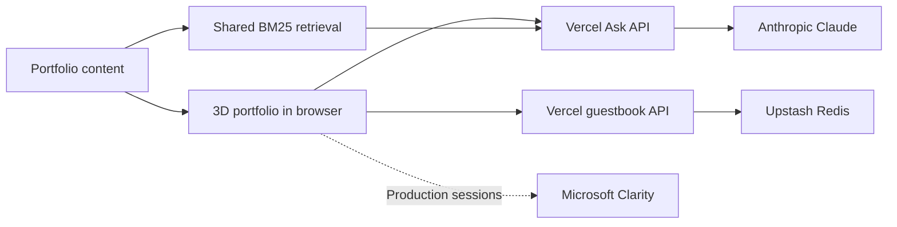

# AI Alo 3D Portfolio

An interactive portfolio for Aloysious Kabonge: a 3D journey through his background, experience, projects, skills and community work, with source-grounded AI answers and a visitor guestbook.

**[Explore the architecture, diagrams and complete technology inventory →](docs/ARCHITECTURE.md)**

**[Open the AI office: Claude, Codex and Grok workspaces →](docs/OFFICE.md)**

**[32-task roadmap](docs/ROADMAP.md) · [Experience design and research](docs/EXPERIENCE-DESIGN.md) · [Release evidence](docs/handoffs/6-codex.md)**

The site uses plain JavaScript ES modules, Three.js, GSAP and Lenis. Vercel serves the static portfolio and two serverless API functions. The configured canonical URL is `https://3d.aialo.io/`; the companion 2D portfolio is `https://aialo.io/`.

## How it fits together



## Run locally

Requires Node.js/npm. Python 3 is used when regenerating the main page.

```bash
npm run dev
# Open http://localhost:5173
```

The development command downloads/runs `serve` through npx. Browser libraries load from jsDelivr using the import map; there is no frontend bundler. Serve over HTTP because the browser uses ES modules. This static development server does not run the Vercel APIs: local retrieval still works, and the guestbook can use browser storage.

## Edit and generate pages

- `src/content.js`: portfolio facts, experience, projects, media references and service endpoints.
- `src/page.html`: main page template, styles and import map.
- `src/main.js`: scene, interactions, audio, question UI and guestbook UI.
- `src/boot.js`: independent loading escape, adaptive controls and visible-viewport measurements.
- `src/atmosphere.js`: local-clock lighting parameters and collision-free annotation placement.
- `src/network.js`: deadlines and cancellation for browser requests.
- `src/ask.js`: shared retrieval, grounding filter and prompt.
- `src/assets/`: photos, MP3 recordings, video and resume PDF.
- `src/favicon.svg`: AK browser icon.
- `src/proofmode.html`: standalone ProofMode case study (hand-written, not generated).
- `.github/workflows/uptime.yml`: scheduled smoke check of the live site, APIs and demos.

After changing the page template or content, regenerate and commit the generated pages:

```bash
npm run build:page
```

The script uses `python` (Python 3) with explicit UTF-8 file encoding. `test/` contains the page generators, mocked API/client tests (`npm test`) and responsive browser checks. See [the quality plan](docs/QUALITY-PLAN.md) for the device matrix, task owners and browser-test commands.

## Deployment

1. Connect this GitHub repository to a Vercel project.
2. Keep the repository root as the project root. `vercel.json` serves `src/`, disables the build command, and configures the API functions.
3. Set `ANTHROPIC_API_KEY` for AI answers. Optionally set `ANTHROPIC_MODEL`; the code default is `claude-haiku-4-5-20251001`.
4. Connect Upstash Redis and set its REST URL/token variables for the shared guestbook. See the [environment table](docs/ARCHITECTURE.md#6-configuration-and-deployment).
5. Redeploy after changing environment variables. Configure your domain in Vercel and keep canonical/share URLs aligned.

The repository describes the deployment configuration; production project settings and connected services must be checked in the hosting account. A push triggers deployment only when that Git integration is configured.

## Answers, visitors and media

Ask Alo searches the same portfolio corpus in the browser and on the server. The browser initially shows a relevant excerpt; the server sends up to three source chunks to Claude for a cited answer. Questions without adequate source matches are rejected. If the model endpoint fails, the local excerpt remains available.

Guestbook notes become stars. Shared notes use Redis; the browser also contains compatibility fallbacks for a Claude-hosted environment and local-only storage. Recorded Luganda greetings and tour audio live in `src/assets/`; Web Audio generates an original ambient score, and browser speech APIs support voice where available. Music starts only after Sound is selected and suspends in background tabs. Tour narration can be muted immediately. Pause motion and the OS reduced-motion preference preserve a calm reading route.

Deep links jump to portfolio sections. `src/text.html` provides a readable text alternative. Devices that report low memory or a data-saver setting, and devices that stay slow after the automatic drop to low quality, get a dismissible offer to open the text version. The Ask panel's **How this works** section explains the retrieval, grounding and cost controls to visitors. Open Graph metadata, `og.jpg`, `robots.txt`, and `sitemap.xml` support discovery and sharing. The main experience conditionally loads Vercel Analytics on configured host families. The main, text and ProofMode pages load Microsoft Clarity project `yr9ooxj17y` only on the canonical `3d.aialo.io` host, excluding local, test and preview traffic.

## Monitoring

`.github/workflows/uptime.yml` runs every 6 hours (and on demand from the Actions tab). It checks that the 3D site, text page and 2D site load, that `/api/ask` returns a real answer, that the guestbook API responds, and that each live demo answers. Failed runs appear in GitHub Actions; email notifications depend on each account’s notification settings. Each run makes one Ask request, which may be served from cache or incur model usage.

## Packages and operating costs

Declared versions: **Three.js 0.186.1**, **GSAP 3.15.0**, **Lenis 1.3.26**. The [architecture guide](docs/ARCHITECTURE.md#5-technology-and-package-inventory) explains each package, browser API, service and helper module.

Hosting, Redis, analytics and model usage depend on your provider plan and traffic. No fixed cost or free-tier allowance is assumed here. The implementation limits model output and source size and caches answers to reduce repeated requests; those caches are not global across server instances.
