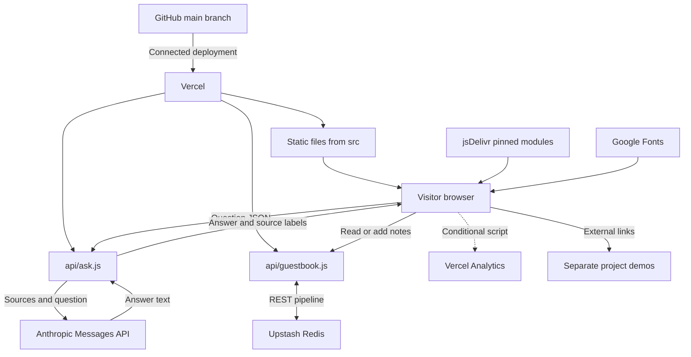
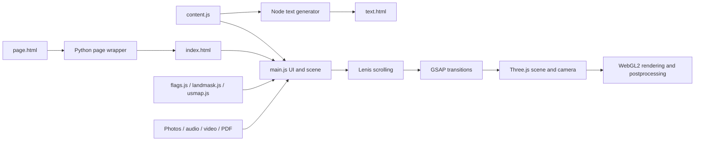
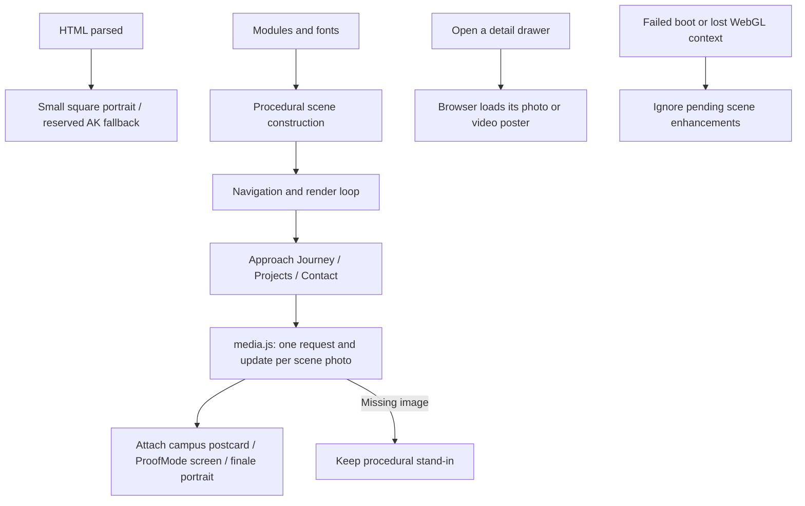
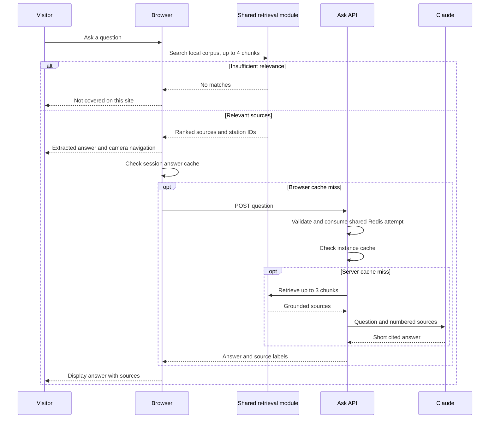
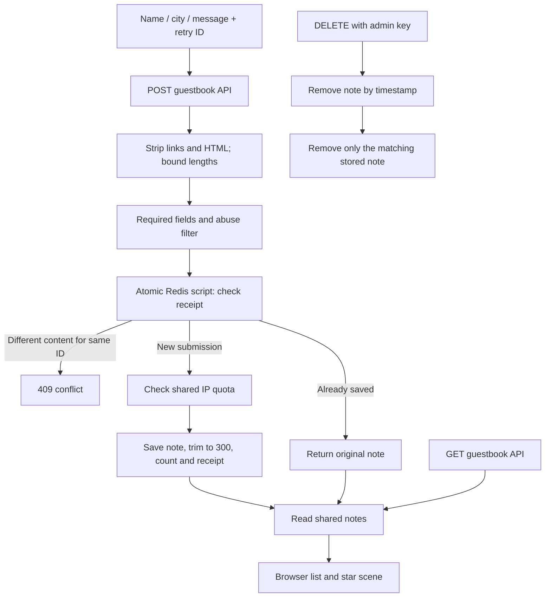
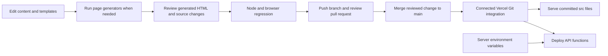

# How the AI Alo portfolio works

Read this as a guided system map: first the whole site, then the browser, answers, guestbook and deployment. The diagrams describe the code in this repository, not unverified infrastructure in a hosting account. File links let you move from each explanation to its implementation.

## 1. The complete system

The browser renders the portfolio. Serverless functions handle operations that need credentials. Redis holds shared guestbook notes; portfolio facts live in source-controlled JavaScript. The Railway-hosted business demos are external destinations, not backend components required to render this portfolio.

Implementation: [deployment configuration](../vercel.json), [page](../src/page.html), [Ask API](../api/ask.js), [guestbook API](../api/guestbook.js).

## 2. From content to a navigable 3D world

1. [`content.js`](../src/content.js) defines profile facts, places, experience, projects, skills, community work, tour narration and endpoint URLs.
2. [`page.html`](../src/page.html) supplies HTML, CSS, accessible controls, metadata and the dependency import map. [`wrap.py`](../test/wrap.py) wraps it into the served `index.html`.
3. [`main.js`](../src/main.js) connects those DOM controls to the scene, camera, native dialogs, question panel and visitor stars. Lenis and GSAP coordinate scrolling and motion. [`boot.js`](../src/boot.js) supplies a dependency-free loading escape, adaptive controls and viewport measurements; [`network.js`](../src/network.js) bounds client requests and forwards cancellation. [`atmosphere.js`](../src/atmosphere.js) computes the artistic local-clock lighting cycle and places labels around reserved reading surfaces. The compact dock also responds to enlarged root text, not only viewport width.
4. Three.js renders the world using WebGL2. Its add-ons provide bloom and other postprocessing passes plus thick line geometry. The map/flag helpers supply custom geographical and visual data.
5. [`make_text.mjs`](../test/make_text.mjs) creates the readable text page from the same facts. This provides an alternative to navigating the 3D scene. Reduced-motion preferences also affect interaction behavior.

Both generated HTML pages are committed. Vercel's configured build command is null, so editing a template alone does not regenerate the deployed page. The favicon is referenced in both page sources to survive regeneration.

### Progressive photos

[`media.js`](../src/media.js) removes photos from the boot dependency chain. The square welcome portrait starts from HTML, independently of modules and other photos; its space and profile button remain available if the image fails. The three scene photos start within one station of their destination, narrowed to half a station when the browser reports Save-Data. Detail-only images start when their drawer opens. The queue runs from the existing station loop, so deep links and navigation jumps use the current scroll position without a separate observer.

Each scene enhancement runs once after its dependent objects exist. UMW adds its clickable postcard; ProofMode adds the screenshot and widens its hit target; the finale repaints its existing texture. Missing photos retain procedural content. Boot failure or context loss suppresses late changes. Browsers without WebGL still have drawer photos and the welcome portrait, without downloading unused scene textures.

This reduces initial media transfer; it does not eliminate module discovery, scene construction, shader compilation, first-render work, or the welcome animation. The measured baseline and subsequent comparison must distinguish these stages. See [Claude's authored design and provenance](handoffs/7-claude-loading.md) and the integration handoff for verification.

## 3. Ask Alo: source-grounded answers, step by step

[`ask.js`](../src/ask.js) builds chunks from the portfolio facts. Tokenization, a small stemmer, stop words and hand-written synonyms feed BM25-style ranking with a source-title boost. A candidate must match at least half the question's term groups and more groups than the count of terms unknown to the corpus. This is why a single shared word such as “white” should not turn a White House question into a White Nile answer.

The browser retrieves up to four chunks and immediately shows two relevant sentences from the best chunk. On pointer devices it navigates to that scene station; touch input stays in place so the keyboard interaction is stable. The server independently retrieves up to three chunks and caps each source text at 700 characters. Its prompt asks Claude for two or three sentences with numbered citations, using only those sources. Output is capped at 220 tokens. Retrieval gating and prompt instructions reduce unsupported answers; generated claims and citations are not independently verified by another model or validator.

The default model identifier in code is `claude-haiku-4-5-20251001`, overridable through `ANTHROPIC_MODEL`. Calls use native `fetch`, not an Anthropic SDK. There is no vector database or embedding service in this portfolio's retrieval path. Technologies such as ChromaDB and Ollama mentioned in project descriptions belong to those projects.

### Caches, limits and fallbacks

| Layer | Current implementation | Scope |
| --- | --- | --- |
| Browser answer cache | Normalized question keys in `sessionStorage` | Browser tab session; no explicit TTL |
| Server answer cache | Up to 300 answers, 24-hour TTL | Warm function instance only |
| Ask request limit | 8 valid attempts per IP in a rolling minute | Shared Redis state across function instances |
| Input bound | Question trimmed to 300 characters | Ask API |
| Server response | `Cache-Control: no-store` | HTTP caching disabled |

The Ask limit uses one atomic Redis sorted-set script and Redis server time. Valid attempts consume quota before cache lookup, retrieval or model access, so warm answers and provider failures cannot bypass the shared ceiling. Invalid methods and malformed bodies do not consume quota. The response includes `Retry-After` on 429. Missing or malformed Redis configuration fails closed with 503; the browser keeps its extracted local answer available.

If the endpoint fails, the browser can use the optional `window.claude` sampling integration when that host supplies it. Otherwise the extracted local answer remains. Ordinary website visitors do not need that integration. No-match server requests return a refusal without calling Claude, after the attempt has been counted. The sequence diagram shows the successful model path; network or provider failures take the fallback path.

## 4. Guestbook: a message becomes a star

[`api/guestbook.js`](../api/guestbook.js) uses the Redis REST API directly. Notes include name, city, message and timestamp. Names are capped at 30 characters, cities at 30 and messages at 90. A single [Redis script](../lib/guestbook-store.js) checks a private retry receipt before the shared IP quota, then saves a new note and its receipt together. Three new notes are allowed in a one-hour window starting at the first accepted note. Further submissions and replays do not extend that expiry. A rejected new submission returns 429 with `Retry-After`.

The browser holds one random submission ID for an unchanged uncertain draft in memory; an explicit retry reuses it. The server compares a hash of the sanitized name/city/message and returns the original note and timestamp, without another list entry or quota charge. Reusing the ID for different content returns 409. Receipts expire after 24 hours; the page stops retrying that draft after 23 hours. Reloading loses the pending browser ID, so check the guestbook before re-entering an uncertain note after a reload. Legacy callers without IDs remain accepted but do not have retry deduplication. No automatic retries are introduced. Private IDs are excluded from public notes.

The script validates existing key types and counter values before writing. [Redis scripts execute atomically](https://redis.io/docs/latest/develop/programmability/eval-intro/), and [Upstash supports EVAL](https://upstash.com/docs/redis/sdks/ts/commands/scripts/eval); this prevents concurrent request interleaving, not rollback after arbitrary runtime/storage failures or durable exactly-once delivery.

The shared list retains at most 300 notes. The UI lists up to 40; local-only fallback storage retains up to 50. At initialization the browser tries the server, then a host-provided Claude database, then `localStorage`. Local notes stay in that browser and are not shared with other visitors. A missing Redis configuration returns 503; upstream storage errors return 502.

An optional admin key authorizes deletion by timestamp. Moderation removes exact stored records with `LREM`, preserving unrelated concurrent additions. Confirmed writes remain successful even if the following list refresh fails. Replaying a receipt does not restore a moderated or trimmed note. The word filter is a basic automated filter, not a complete moderation system.

## 5. Technology and package inventory

Versions below are the repository's declared versions, not claims about the latest releases.

| Technology | Version/source | Role here |
| --- | --- | --- |
| HTML and CSS | Native web platform | Semantic sections, responsive layout, overlays, controls, metadata |
| JavaScript ES modules | Native browser and Node.js modules | Shared content/retrieval and application code |
| `three` | 0.186.1 | Scene, geometry, camera, materials, WebGL2 renderer |
| Three.js add-ons | Same package/version | EffectComposer, RenderPass, UnrealBloomPass, OutputPass, ShaderPass, LineSegments2, LineSegmentsGeometry, LineMaterial |
| `gsap` | 3.15.0 | Animation and transitions |
| `lenis` | 1.3.26 | Smooth scrolling |
| jsDelivr | Browser import map | Delivers the three pinned packages without a bundle step |
| `serve` | Unpinned npx development command | Local static HTTP server; not a declared runtime dependency |
| Node.js/npm | No engine version pinned | API JavaScript, text generator and development commands |
| Python 3 | Standard library only | Wraps the main HTML template |
| Vercel | `vercel.json` | Static serving and serverless functions; optional analytics script |
| Anthropic Messages API | Native HTTPS fetch | Generates cited answers from retrieved portfolio sources |
| Upstash Redis REST API | Native HTTPS fetch | Shared guestbook state and Ask attempt counters |
| Web Audio API | Browser | Synthesized ambient sound and effects |
| HTML media APIs | Browser | Recorded MP3 greetings/tours and MP4 video |
| Web Speech APIs | Browser-dependent | Speech synthesis and supported voice input |
| Web Storage | Browser | Session answer cache, preferences and local guestbook fallback |
| Google Fonts | Hosted CSS/font files | Bricolage Grotesque, IBM Plex Mono and IBM Plex Sans |
| SVG, JPEG, PDF | Static assets | Favicon, photos/share card and downloadable resume |
| Git/GitHub | Repository workflow | Source history and hosting integration input |
| Mermaid | GitHub Markdown rendering | Architecture diagrams in these docs; no website runtime dependency |
| Playwright | 1.62.1 development dependency | Local mocked browser regression checks; not shipped to visitors |

[`package.json`](../package.json) declares only three runtime packages. The browser uses the versions in the import map, so keep that map and the manifest synchronized when upgrading. Custom `flags.js`, `landmask.js`, `usmap.js` and `ask.js` are local modules, not npm packages. The optional `window.claude` capabilities are host integrations, not installed dependencies.

## 6. Configuration and deployment

| Variable | Purpose | Required for |
| --- | --- | --- |
| `ANTHROPIC_API_KEY` | Authenticates model requests | Server-generated answers |
| `ANTHROPIC_MODEL` | Overrides the model identifier | Optional |
| `UPSTASH_REDIS_REST_URL` | Redis REST endpoint | Shared guestbook and Ask limit |
| `UPSTASH_REDIS_REST_TOKEN` | Redis REST credential | Shared guestbook and Ask limit |
| `KV_REST_API_URL` / `KV_REST_API_TOKEN` | Supported alternative Redis names; take precedence | Alternative to Upstash-named variables |
| `GUESTBOOK_ADMIN_KEY` | Authorizes note deletion | Optional moderation |

Secrets belong in the server environment, never in `src/`. Questions travel to the Ask function and, on an uncached model request, to Anthropic with selected public portfolio facts. Guestbook submissions travel to the function and Redis. HMAC-derived Redis keys use the existing Redis token as their private key material, so raw visitor IPs are not stored in Redis.

The output directory is `src`. Ask has a configured maximum duration of 20 seconds and guestbook 10 seconds; internal upstream/storage deadlines are 12 and 7 seconds respectively. `package-lock.json` records dependency resolution, and the quality workflow tests with Node 24. The deployment Node engine is not pinned in the manifest. Domain, DNS, actual environment values, analytics enablement and deployment success are hosting-account state, not established by these files.

## 7. Operating boundaries and future improvements

The site can deliver its static content independently of model and guestbook availability. Its browser still depends on external module/font delivery for the full visual experience. The text page provides a simpler reading path.

The current implementation has no distributed answer cache or model citation verifier. Its shared Ask limiter bounds attempts across healthy Redis-backed function instances, but it is an abuse and cost guard rather than identity verification; proxies, shared networks and IP rotation remain limits. A scheduled GitHub Actions smoke check (`.github/workflows/uptime.yml`) verifies the live pages, both APIs and the demos every 6 hours. The separate quality workflow runs generated-page, mocked API/client, actual disposable-Redis and browser regression checks on pull requests and main. A trusted-default-branch workflow resolves the successful Vercel deployment for the tested commit and validates it without a model call or guestbook write.

Keep the facts and generated pages synchronized and review model/provider usage in their dashboards. The shared limit is a bounded operational control, not a guaranteed global cost ceiling during Redis outage or infrastructure failure; the API fails closed when the limiter is unavailable. This architecture deliberately keeps public content in Git and credentials in the server runtime.
