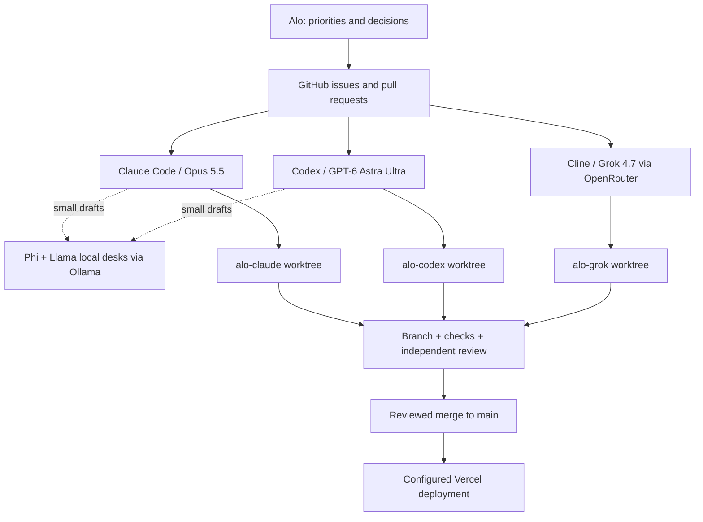

# Alo's AI office

One VS Code office window contains the Claude, Codex and Grok working folders. They can run simultaneously while editing independent Git worktrees. Each extension still has its own conversation: tasks, branches, PRs and handoffs are the shared record.



## Desks and models

| Desk | Starting role | Tool and selection | Git branch namespace |
| --- | --- | --- | --- |
| Claude | Architecture, UX, writing and review | Claude Code; `claude-opus-5-5` | `claude/*` |
| Codex | Implementation, checks and assigned integration | Codex; `gpt-6-astra`, `ultra` reasoning | `codex/*` |
| Grok | Current research and independent critique | Cline → OpenRouter → `x-ai/grok-4.7` | `grok/*` |
| Phi (local) | Proofreading short copy | `scripts/office/local.ps1` → Ollama → `phi4-mini` | None: drafts only |
| Llama (local) | Plain-language rewrites, summaries, commit-message drafts | `scripts/office/local.ps1` → Ollama → `llama3.1:8b-instruct-q4_K_M` | None: drafts only |

These roles are practical starting assignments. Claude's model is configured in `.claude/settings.json`. Codex's project configuration is in `.codex/config.toml`; trusted project settings and the model picker should be checked when opening the desk. They do not change the model of an already-running conversation. Grok's provider and key are selected privately in Cline settings, not in tracked files.

## Open the office on this computer

From the `alo_rag2` repository in PowerShell:

```powershell
./scripts/office/setup.ps1
./scripts/office/open.ps1
./scripts/office/status.ps1
```

Setup creates sibling folders `alo-claude`, `alo-codex`, `alo-grok` and local workspace files in `alo-office`. By default, `open.ps1` opens **Alo Office.code-workspace** in one VS Code window using the Default profile, where all three extensions are installed. The Explorer shows three folders. Opening the office does not send a model request or start a recurring background agent.

The main repository stays separate. Setup preserves existing worktrees and custom workspace settings, refuses mismatched folders, and supports `-WhatIf`. It never resets or deletes work. Fetch changes first if you want a newly created branch to use the newest `origin/main`:

```powershell
git fetch origin
./scripts/office/setup.ps1 -BaseRef origin/main
```

Separate desk windows are optional: `./scripts/office/open.ps1 -Agent Claude` (or `Codex` / `Grok`). For the normal single-window office, omit `-Agent`. Keep concurrent edits inside the assigned worktree. Before starting a task, tell the extension which folder to use and have it confirm the Git root and branch. Do not assume all extensions select the same root in a multi-folder workspace. All worktrees share Git refs and remote credentials, but not uncommitted files.

The shared workspace lists Grok first because Cline loads its rules and Git context from the primary folder. Cline's automatic checkpoints are unavailable in multi-root workspaces, so use Git commits for recovery. Claude and Codex should explicitly work in their named folder. See [Cline's multi-root guidance](https://docs.cline.bot/features/multiroot-workspace).

## Local desks (Phi and Llama)

Two small models run on this laptop through Ollama. They cost nothing per request and send nothing to a cloud provider, so they suit private or repetitive drafting. They are helpers to the other desks, not independent workers: they have no worktree, do not edit files or run Git, and are never a source of portfolio facts.

```powershell
./scripts/office/local.ps1 -Task proofread -Path <file>        # Phi: typos, repeated words, em dashes
./scripts/office/local.ps1 -Task plain -Path <file>            # Llama: plain-language rewrite, facts kept
./scripts/office/local.ps1 -Task summarize -Path <handoff.md>  # Llama: 5-bullet summary for Alo
git diff --stat origin/main | ./scripts/office/local.ps1 -Task commit  # Llama: commit-message draft
```

Each run saves a draft with model, digest, input hash and timing under `alo-office/local/`. The desk that asked for it verifies the draft before using it. Use `-Desk phi` or `-Desk llama` to override the default model.

Limits measured on this laptop (Intel Core Ultra 5 125U, 16 GB RAM, no discrete GPU) on 2026-10-01: phi4-mini about 8 tokens/s, llama3.1 8B about 5 tokens/s plus a model load of up to 25 s. Input is capped at 6,000 characters; send excerpts, not whole source files. Only one model fits in memory alongside VS Code, so run local jobs one at a time. In testing, Phi found a spelling error and two repeated words but missed an em dash; the script therefore reports em dashes itself.

Do not point Cline or another agent loop at these models. A full agent prompt would take many minutes to read at these speeds, and 8B-class models are unreliable at multi-file edits.

## Connect accounts

- **Claude:** open the Claude Code panel and use the `alo-claude` folder. Use the existing Claude sign-in, or sign in if requested. Confirm Opus 5.5 in its model picker. Subscription access and usage limits are account-dependent.
- **Codex:** open the Codex panel and use `alo-codex`. Use the existing ChatGPT sign-in. Confirm GPT-6 Astra with Ultra reasoning. A new project may need to be trusted before its settings load.
- **Grok:** open Cline settings and use `alo-grok` for tasks. Select **OpenRouter**, enter the API key privately in that settings panel, and choose **`x-ai/grok-4.7`**. Use the same provider/model for Plan and Act if you want one model at this desk. Configure provider spending limits in your OpenRouter account before sustained use. Grok requests are billed separately from Claude/ChatGPT subscriptions.

For first-time OpenRouter setup, open [OpenRouter](https://openrouter.ai/) and complete sign-in/account creation, then open [API keys](https://openrouter.ai/settings/keys). Create a key named `Alo Office` with a budget you choose, and paste it directly into Cline's OpenRouter API-key field. Account agreements, payment and the private key remain under your control. Send a short greeting after selecting the model to confirm connection; the desk is not connected until that succeeds.

Do not put credentials into instructions, source files, issues or chat. The initial office installation added the tools; the reusable `setup.ps1` only creates worktrees and workspace files. Neither creates an OpenRouter account, purchases credits or establishes a connected Grok session until its provider is configured and a request succeeds.

## A working day

1. Give each task an issue, one owner label (`agent:claude`, `agent:codex`, `agent:grok`) and observable acceptance criteria. Agree on ownership of overlapping files before editing.
2. In the agent's worktree, ensure no changes are pending, fetch, then create an owner-prefixed branch from `origin/main`, for example `git switch -c codex/mobile-diagram origin/main`.
3. Work and verify against the issue. Follow `AGENTS.md`; Claude imports it through `CLAUDE.md`, and Cline receives the office rules through `.clinerules/office.md`.
4. Add a task-specific handoff under `docs/handoffs/`, commit, push the task branch and open a PR. Ask another desk for a review by giving it the issue and PR links. A folder or Markdown file does not automatically wake another agent.
5. Review the actual diff and checks. Use a Vercel preview only if that deployment exists. Merge as the assigned integrator or at Alo's direction, then verify the resulting deployment.

Agents can create separate tasks without waiting for a single lead engineer. Do not have all agents edit `docs/HANDOFF.md` at once: use one handoff file per issue and agent. GitHub issues/PRs are the shared, current task board.

## GitHub commands

GitHub CLI is used for issues and PRs. On this machine, `github.ps1` can reuse the same GitHub credential that Git already uses; it does not store a duplicate token. A normal `gh` sign-in is also fine.

```powershell
./scripts/office/github.ps1 issue list --repo akabonge/alo_rag2 --label office:task
./scripts/office/github.ps1 pr list --repo akabonge/alo_rag2
```

For a multiline PR description, write a Markdown file and pass `--body-file` to `pr create`. Keep provider credentials out of that file. The issue template records ownership and acceptance criteria; the PR template records validation and handoff evidence.

## First assignments

The initial setup created [Claude issue #1](https://github.com/akabonge/alo_rag2/issues/1), [Codex issue #2](https://github.com/akabonge/alo_rag2/issues/2), and [Grok issue #3](https://github.com/akabonge/alo_rag2/issues/3). Re-running `setup.ps1` does not duplicate these issues or install extensions.

**Claude prompt**

> Read AGENTS.md, docs/OFFICE.md and the Claude-labeled issue. Review mobile navigation and readability, including the ProofMode architecture. Return a prioritized critique with concrete file references and a proposed small first change. Do not edit another desk's assigned files.

**Codex prompt**

> Read AGENTS.md, docs/OFFICE.md and the Codex-labeled issue. Implement the scoped mobile ProofMode architecture improvement in your worktree. Preserve factual accuracy, include a readable text equivalent, run relevant checks, and open a PR with a handoff.

**Grok prompt**

> Read AGENTS.md, docs/OFFICE.md and the Grok-labeled issue. Independently review the AI explanation and ProofMode claims. Separate verified findings from suggestions; cite primary sources and file references. Produce a handoff for the implementing agent.

## What is deliberately separate

MCP connects an agent to tools; OpenRouter routes model requests; Git worktrees isolate edits. None of those automatically schedules colleagues or merges their work. No unrestricted shell execution or automatic paid model loop is enabled by this setup. Cross-agent orchestration can be added once the three desks have a reliable working loop.

The older pasted `codex mcp-server` command is not exposed by the Codex CLI currently installed here. This office uses the supported IDE/worktree approach rather than adding an unverified bridge.

## Verified reference points

Checked during setup on 2026-09-30:

- [Codex IDE](https://developers.openai.com/codex/ide/) and [AGENTS.md behavior](https://developers.openai.com/codex/guides/agents-md/).
- [Claude Code in VS Code](https://code.claude.com/docs/en/vs-code), [model configuration](https://code.claude.com/docs/en/model-config) and [shared memory](https://code.claude.com/docs/en/memory).
- [Cline OpenRouter setup](https://docs.cline.bot/provider-config/openrouter) and [Cline rules](https://docs.cline.bot/features/cline-rules).
- [OpenRouter model catalog](https://openrouter.ai/api/v1/models) lists `x-ai/grok-4.7`; the local Codex catalog lists `gpt-6-astra` and Ultra support. Model availability still depends on your account/provider.
