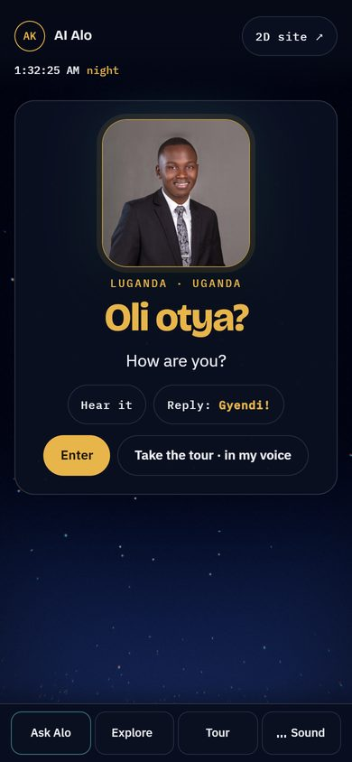
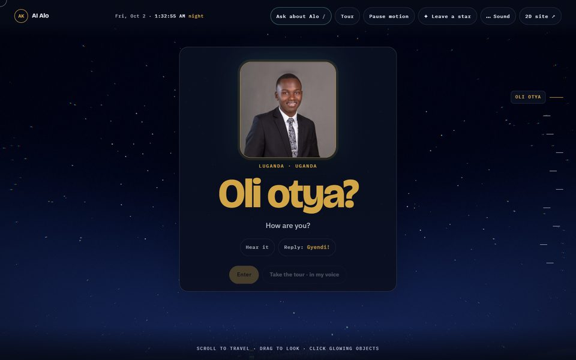
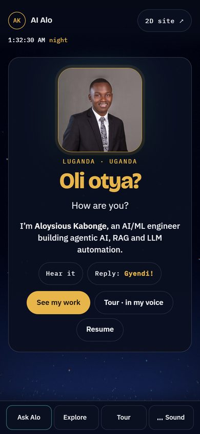
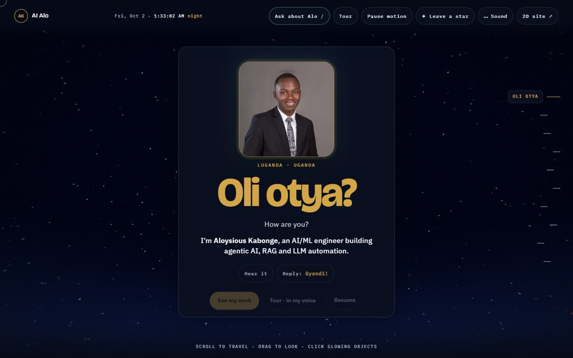
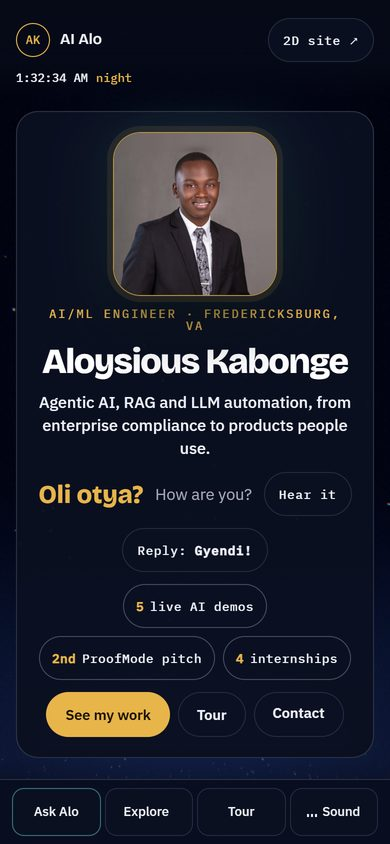
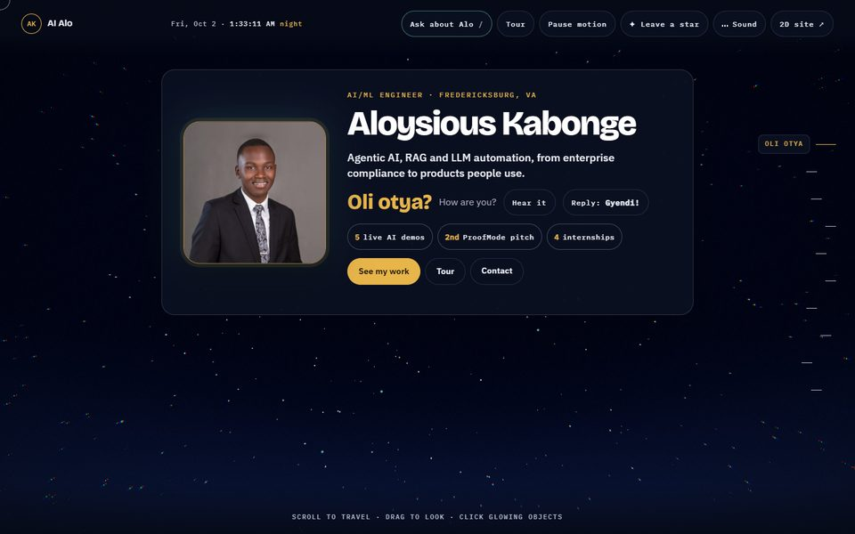
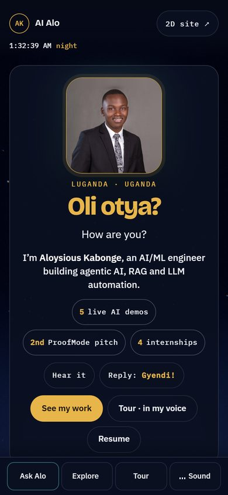
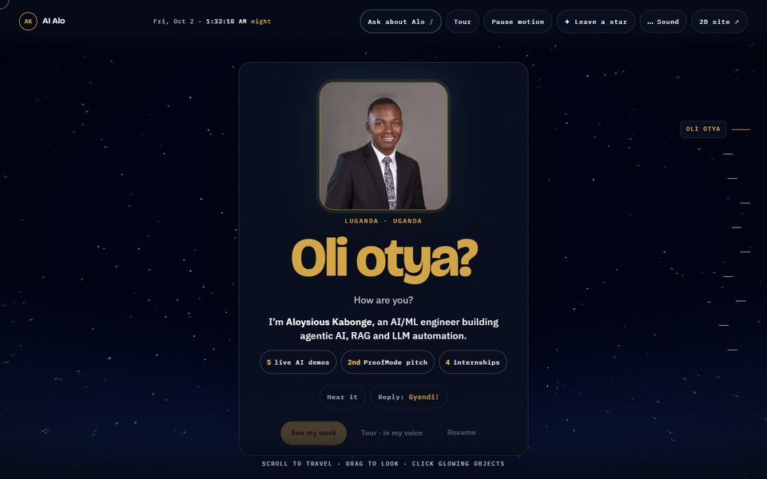

# First screen: hierarchy and project discovery (issue #11)

Owner: Claude. Implementer/reviewer: Codex. Critique: Grok. Decision: Alo.

## Problem

Captured from production (`7e2bbbf`) on 2026-10-02 at 390×844 and 1440×900, after the loader cleared.

| Phone, current | Desktop, current |
| --- | --- |
|  |  |

The first screen shows a portrait, a Luganda greeting and two buttons: **Enter** and **Take the tour**. It does not say:

1. **Who this is.** The name is only in the portrait's `alt` and `aria-label`. The visible name, role and resume link are on the second station (`#hero`), reached by scrolling or **Enter**.
2. **What the strongest work is.** The facts row (5 live demos, 4 internships) is also on `#hero`. Projects are four stations down.
3. **How to make contact.** No contact route is visible on phone. On desktop, only the HUD offers Ask.

The page also has two `h1` elements (`.oli` and `#hero h1`). The first one a screen reader or search engine meets is "Oli otya?", not Alo's name.

The greeting, recorded audio and the 3D journey are the site's identity. Every option below keeps them.

## Visitor walkthrough: a recruiter with 30 seconds

| Step | Current | A | B (desktop) |
| --- | --- | --- | --- |
| Who is this? | Scroll or tap Enter, read `#hero` | Visible on load | Visible on load, as the largest text |
| What do they do? | `#hero` subtitle | Visible on load | Visible on load |
| Best work | Scroll 4 stations, or tap Explore | One tap: **See my work** | Proof chips visible; one tap |
| Resume / contact | Resume on `#hero`; contact is the last station | **Resume** on the first screen | **Contact** on the first screen |
| Greeting | Hero of the screen | Hero of the screen | Kept, one line, still plays |

## Options

Mockups were made by injecting markup into the live page in a browser. They are not shipped code. All copy reuses claims already on the site (`PROFILE.role`, `PROFILE.focus`, `PROFILE.pitch`, the `#hero` facts row, ProofMode's result).

### A: Name it (smallest change)

Add one line under "How are you?": *I'm **Aloysious Kabonge**, an AI/ML engineer building agentic AI, RAG and LLM automation.* Rename **Enter** to **See my work** (jump to `#projects`), shorten the tour button, and add **Resume**.

| Phone | Desktop |
| --- | --- |
|  |  |

- Measured: card bottom 685 px on phone (dock starts at 788), 798 px on desktop (viewport 900). No horizontal overflow.
- Pros: greeting still leads; about 10 lines of change; no layout risk.
- Cons: name is body text, not a heading; no proof on screen.

### B: Identity first, side by side on desktop

The name becomes the heading. Role eyebrow, one-line pitch, greeting as a single line with **Hear it** and **Reply**, three proof chips, then **See my work · Tour · Contact**. On wide screens, the portrait sits left of the text.

| Phone | Desktop |
| --- | --- |
|  |  |

- Measured: desktop card is 414 px tall and leaves the 3D sky visible. Phone card ends at 758 px, under the dock but crowded: chips wrap into four rows.
- Pros: strongest answer to all three questions on desktop; fixes the heading order.
- Cons: the greeting is no longer the centrepiece; larger CSS change; phone is too dense.

### C: A plus proof chips (rejected)

| Phone | Desktop |
| --- | --- |
|  |  |

- Phone card ends at 793 px, behind the dock (788). Desktop buttons fall into the bottom fade and the scroll hint. Too tall on both.

## Recommendation

**B on desktop (≥ 900 px), A on phone.** Desktop has room to answer every recruiter question without losing the greeting. Phone keeps the greeting as the hero and adds only the identity line and the work/resume buttons.

If Alo prefers one layout everywhere, ship **A**: it is safe, small and already fixes the biggest gap (no name on screen).

## Acceptance for the implementer

1. At 390×844, 360×740 and 1440×900, the name, role and **See my work** are visible without scrolling, and the card does not overlap the dock or scroll hint.
2. **See my work** reaches `#projects` with the same motion/reduced-motion behaviour as existing `data-jump` buttons; **Resume** keeps the existing PDF `href` and `download`.
3. **Hear it**, **Reply: Gyendi!**, the reply text and the tour still work. The greeting keeps `lang="lg"`.
4. In option B, exactly one `h1` contains the name; the greeting is not an `h1`. In option A, document the heading order chosen.
5. `src/index.html` and `src/text.html` are regenerated; no new factual claims; existing responsive, experience and media checks pass.
6. Keyboard order: portrait → name/greeting controls → primary CTA → others. Focus is visible on every new control.

## Open questions for Alo

- A, B, or the hybrid?
- Proof chip wording: "2nd place, UMW pitch competition" is accurate to `content.js`; "2nd ProofMode pitch" in the mockup is shorter but vaguer.
- `PROFILE.linkedin` is `linkedin.com/in/aloysious-kabonge`; Alo's notes list `linkedin.com/in/akabonge`. Which is correct? (Not changed here.)

## Local desk note

Phi proofread the new copy (`alo-office/local/2026-10-02-013446-phi-proofread.md`). All three suggestions were rejected: it "corrected" Aloysious to Aloysius, preferred "Virginia" to the site's "VA", and wanted to remove the `·` separator.
